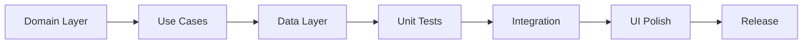

# Next Steps Implementation Plan

**Date**: 2025-08-18  
**Current State**: Clean Architecture with Riverpod fully implemented  
**Priority**: Complete missing domain layers and implement core functionality

## Immediate Priority Tasks (Week 1)

### 1. Complete Domain Layer Implementation
**Priority**: HIGH  
**Estimated Time**: 2-3 days

#### Scanner Feature Domain
```dart
// Required implementations:
lib/features/scanner/domain/
├── entities/
│   ├── scan_result.dart
│   ├── scan_session.dart
│   └── barcode_data.dart
├── repositories/
│   └── scanner_repository.dart
├── usecases/
│   ├── start_scan_session.dart
│   ├── process_barcode.dart
│   ├── validate_device_scan.dart
│   └── complete_scan_session.dart
└── value_objects/
    ├── mac_address.dart
    ├── serial_number.dart
    └── part_number.dart
```

#### Notifications Domain
```dart
lib/features/notifications/domain/
├── entities/
│   └── notification.dart (with Freezed)
├── repositories/
│   └── notification_repository.dart
└── usecases/
    ├── get_notifications.dart
    ├── mark_as_read.dart
    └── delete_notification.dart
```

#### Settings Domain
```dart
lib/features/settings/domain/
├── entities/
│   └── app_settings.dart
├── repositories/
│   └── settings_repository.dart
└── usecases/
    ├── get_settings.dart
    ├── update_settings.dart
    └── reset_settings.dart
```

### 2. Implement Scanner Functionality
**Priority**: HIGH  
**Estimated Time**: 3-4 days

- [ ] Integrate mobile_scanner package
- [ ] Implement QR code parsing for authentication
- [ ] Implement barcode scanning for devices
- [ ] Add scan accumulation logic
- [ ] Create scan validation rules
- [ ] Add visual feedback and progress tracking

### 3. Add Unit Tests
**Priority**: HIGH  
**Estimated Time**: 2-3 days

```yaml
Test Coverage Goals:
- Use Cases: 100%
- Repositories: 90%
- Providers: 80%
- Critical Business Logic: 100%
```

#### Test Structure:
```
test/
├── unit/
│   ├── features/
│   │   ├── auth/
│   │   │   ├── usecases/
│   │   │   └── repositories/
│   │   ├── devices/
│   │   ├── rooms/
│   │   └── scanner/
│   └── core/
├── widget/
│   └── features/
└── integration/
    └── scenarios/
```

## Short-Term Goals (Weeks 2-3)

### 4. API Integration
**Priority**: MEDIUM  
**Estimated Time**: 3-4 days

- [ ] Replace mock repositories with real API implementations
- [ ] Add retry logic and timeout handling
- [ ] Implement request caching
- [ ] Add request/response logging
- [ ] Handle various HTTP status codes properly

### 5. Offline Support
**Priority**: MEDIUM  
**Estimated Time**: 3-4 days

```dart
// Implementation approach:
1. Add drift for local database
2. Create sync queue for offline operations
3. Implement conflict resolution
4. Add background sync
5. Show offline indicators in UI
```

### 6. Error Tracking & Analytics
**Priority**: MEDIUM  
**Estimated Time**: 2 days

- [ ] Integrate Sentry for crash reporting
- [ ] Add performance monitoring
- [ ] Implement user analytics
- [ ] Create custom error boundaries

## Medium-Term Goals (Weeks 4-6)

### 7. Performance Optimization
- [ ] Implement lazy loading for lists
- [ ] Add image caching strategies
- [ ] Optimize widget rebuilds
- [ ] Reduce app bundle size
- [ ] Profile memory usage

### 8. Platform-Specific Features
- [ ] iOS: Face ID/Touch ID authentication
- [ ] Android: Fingerprint authentication
- [ ] Desktop: Keyboard shortcuts
- [ ] Web: PWA capabilities

### 9. UI/UX Enhancements
- [ ] Add animations and transitions
- [ ] Implement pull-to-refresh
- [ ] Add skeleton loaders
- [ ] Create onboarding flow
- [ ] Implement dark/light theme toggle

## Implementation Checklist

### Week 1 Tasks
- [ ] Complete Scanner domain layer
- [ ] Complete Notifications domain layer
- [ ] Complete Settings domain layer
- [ ] Update providers to use new use cases
- [ ] Implement basic scanner functionality
- [ ] Write unit tests for critical paths

### Week 2 Tasks
- [ ] Integrate real API endpoints
- [ ] Add offline database (drift)
- [ ] Implement sync queue
- [ ] Add Sentry integration
- [ ] Write widget tests

### Week 3 Tasks
- [ ] Add performance monitoring
- [ ] Implement biometric authentication
- [ ] Add UI polish and animations
- [ ] Complete integration tests
- [ ] Update documentation

## Technical Debt to Address

### High Priority
1. **Scanner Implementation**: Currently UI-only, needs full implementation
2. **Test Coverage**: No tests currently exist
3. **API Integration**: Still using mock data

### Medium Priority
1. **Documentation**: Inline documentation needs improvement
2. **Error Messages**: Need user-friendly error messages
3. **Accessibility**: Add semantic labels and screen reader support

### Low Priority
1. **Code Comments**: Add more descriptive comments
2. **Logging**: Implement structured logging
3. **Feature Flags**: Add feature toggle system

## Success Metrics

### Code Quality
- [ ] 80%+ test coverage
- [ ] 0 critical lint issues
- [ ] <5% code duplication
- [ ] All features have domain layer

### Performance
- [ ] App launch <2 seconds
- [ ] Screen navigation <300ms
- [ ] 60 FPS scrolling
- [ ] <150MB memory usage

### User Experience
- [ ] Offline functionality works seamlessly
- [ ] Scanner processes barcodes in <500ms
- [ ] All errors have user-friendly messages
- [ ] Smooth animations throughout

## Risk Mitigation

### Technical Risks
1. **Scanner Performance**: Test on various devices early
2. **API Changes**: Implement versioning strategy
3. **State Management Complexity**: Keep providers simple and focused

### Project Risks
1. **Scope Creep**: Stick to planned features
2. **Testing Delays**: Write tests alongside code
3. **Documentation Lag**: Update docs with each PR

## Recommended Development Flow



## Daily Development Routine

1. **Morning**
   - Review yesterday's work
   - Plan today's tasks
   - Update todo list

2. **Development**
   - Implement feature
   - Write tests
   - Update documentation

3. **End of Day**
   - Commit changes
   - Update progress tracking
   - Note any blockers

## Commit Strategy

```bash
# Feature commits
feat(scanner): implement QR code parsing
feat(auth): add biometric authentication

# Fix commits
fix(devices): resolve filter state persistence
fix(navigation): correct deep link handling

# Test commits
test(auth): add use case unit tests
test(scanner): add widget tests

# Documentation commits
docs(api): update API integration guide
docs(architecture): add decision records
```

## Definition of Done

A feature is considered complete when:
- [ ] Domain layer implemented
- [ ] Data layer implemented
- [ ] Presentation layer implemented
- [ ] Unit tests written (>80% coverage)
- [ ] Widget tests written
- [ ] Documentation updated
- [ ] Code reviewed
- [ ] No lint issues
- [ ] Merged to main branch

## Conclusion

The application has a solid Clean Architecture foundation with Riverpod state management. The immediate priority is completing the domain layers for Scanner, Notifications, and Settings features, followed by implementing actual scanner functionality and comprehensive testing. With the current architecture, adding these features should be straightforward and maintainable.