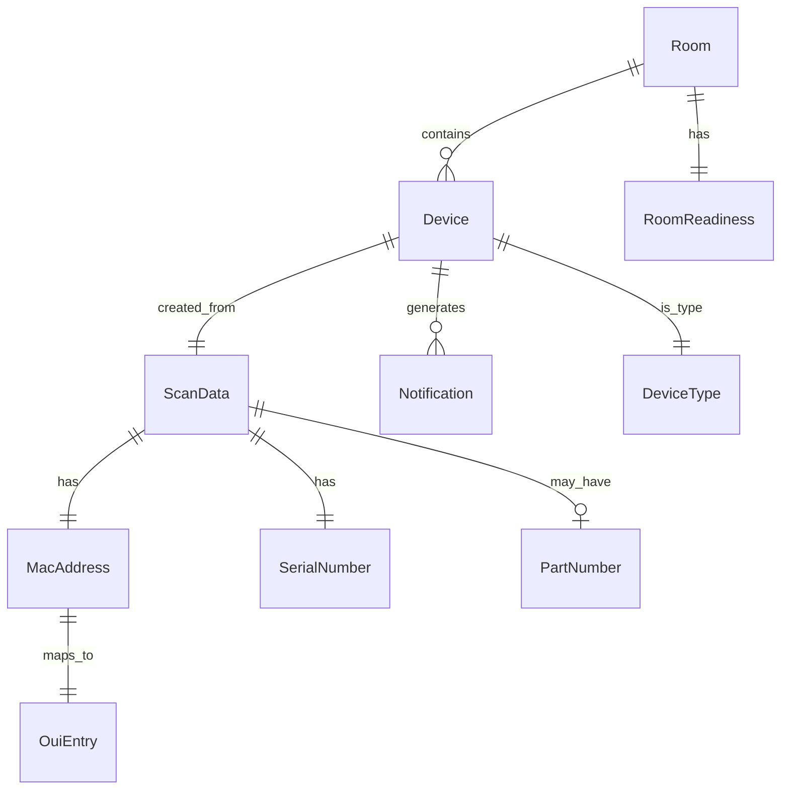

# Data Models - RG Nets Field Deployment Kit

**Generated**: 2025-08-18
**Last Updated**: 2025-08-18 (Verified Implementation)
**Status**: ACTUAL DATA STRUCTURES

## ACTUAL API DATA MODELS (Confirmed Working)

### Pagination Wrapper (All List Endpoints)
```json
{
  "count": number,        // Total items
  "page": number,         // Current page
  "page_size": number,    // Items per page  
  "total_pages": number,  // Total pages
  "next": string | null,  // URL to next page
  "results": []          // Actual data array
}
```

### Working API Endpoints & Data

#### 1. Access Points (`/api/access_points.json`)
- **Status**: ✅ WORKING
- **Count**: 221 items
- **Paginated**: Yes (30 per page)

#### 2. Media Converters/ONTs (`/api/media_converters.json`)
- **Status**: ✅ WORKING  
- **Count**: 151 items
- **Paginated**: Yes (30 per page)

#### 3. Switch Devices (`/api/switch_devices.json`)
- **Status**: ✅ WORKING
- **Count**: 1 item
- **Paginated**: Yes

#### 4. PMS Rooms (`/api/pms_rooms.json`)
- **Status**: ✅ WORKING
- **Count**: 141 items
- **Paginated**: Yes (30 per page)

#### 5. WLAN Controllers (`/api/wlan_controllers.json`)
- **Status**: ❌ DOES NOT EXIST (404)

#### 6. Notifications (`/api/notifications.json`)
- **Status**: ❌ DOES NOT EXIST (404)

### Access Point Model (Actual from API)
```json
{
  "id": 379,
  "name": "AP1-8-0023-WF189-RM803",
  "mac": "d4:ba:ba:a3:9b:80",
  "serial_number": "1K9251400023",
  "model": "CIG WF189",
  "version": "TIP-rgnets-4.0.0-0.016-80b4adb0",
  "online": false,          // Used for notification generation
  "ip": null,
  "connection_state": "socket (1033: Device is not currently connected.)",
  "channel_24": 1,          // 2.4GHz channel
  "channel_5": 138,         // 5GHz channel
  "channel_6": 79,          // 6GHz channel
  "access_point_profile": {
    "id": 1,
    "name": "Default AP Profile SDK"
  },
  "pms_room": {
    "id": 128,
    "name": "(Interurban) 803"
  }
}
```

### Media Converter/ONT Model (Actual from API)
```json
{
  "id": number,
  "name": string,
  "serial_number": string,   // Format: ALCL[8 chars] for Nokia
  "mac_address": string,
  "online": boolean,         // Used for notification generation
  "note": string | null,     // Triggers medium priority notifications
  // Additional ONT-specific fields
}
```

### Switch Device Model (Minimal in production)
```json
{
  "id": 70,
  "name": "MF2-01",
  "serial_number": "YP2444SH085",
  "online": true,           // Used for notification generation
  "note": null,             // Would trigger notification if present
  // 150+ additional fields available but not used
}
```

### PMS Room Model (Actual from API)
```json
{
  "id": 128,
  "name": "(Interurban) 803"
  // Room readiness calculated client-side (not implemented)
}
```

### Client-Side Notification Model
```typescript
// Generated locally, not from API
interface DeviceNotification {
  deviceId: number;
  deviceType: 'access_point' | 'ont' | 'switch';
  priority: 'urgent' | 'medium' | 'low';
  message: string;
  timestamp: Date;
  
  // Priority logic:
  // urgent: device.online === false
  // medium: device.note !== null
  // low: device.images === null || empty
}
```

## QR Scanner Implementation (6-Second Window)

### Scanner Requirements by Device Type
```dart
// ACTUAL IMPLEMENTATION
enum DeviceType {
  access_point,  // Requires: 2 barcodes (serial + MAC)
  ont,           // Requires: 2-3 barcodes (serial + MAC + optional)
  switch_device  // Requires: 1 barcode (serial only)
}

// Accumulation window: 6 seconds
// User selects device type BEFORE scanning
// Visual countdown timer shown
// Batch processing after timeout
```

### Scan Accumulator Logic
```dart
class ScanAccumulator {
  static const Duration WINDOW = Duration(seconds: 6);
  
  // Collects multiple barcodes within 6-second window
  // Deduplicates same barcode
  // Validates based on device type
  // Enables registration when minimum met
}
```

### Device Type Mapping (Internal vs API)
```dart
// Internal app types vs API endpoints
Map<String, String> deviceTypeToEndpoint = {
  'access_point': '/api/access_points.json',      // ✅ Works
  'ont': '/api/media_converters.json',            // ✅ Works
  'switch': '/api/switch_devices.json',           // ✅ Works
  'wlan_controller': '/api/wlan_controllers.json' // ❌ 404
};
```

## Value Objects

### Barcode
**Trace**: lib/features/scanner/domain/value_objects/barcode.dart
```dart
class Barcode {
  final String value;
  final BarcodeType type;
  final double confidence;
  
  enum BarcodeType {
    qrCode,
    code128,
    code39,
    ean13,
    ean8,
    upcA,
    upcE,
    dataMatrix,
    pdf417,
    aztec,
    unknown
  }
}
```

### MAC Address
**Trace**: lib/features/scanner/domain/value_objects/mac_address.dart
```dart
class MacAddress {
  final String value;  // Normalized format: XX:XX:XX:XX:XX:XX
  
  // Validation patterns
  static final RegExp colonFormat = RegExp(r'^([0-9A-Fa-f]{2}:){5}[0-9A-Fa-f]{2}$');
  static final RegExp dashFormat = RegExp(r'^([0-9A-Fa-f]{2}-){5}[0-9A-Fa-f]{2}$');
  static final RegExp dotFormat = RegExp(r'^([0-9A-Fa-f]{4}\.){2}[0-9A-Fa-f]{4}$');
  static final RegExp noDelimiter = RegExp(r'^[0-9A-Fa-f]{12}$');
  
  String getManufacturer() {
    // Lookup in MAC database
    final oui = value.substring(0, 8);
    return macDatabase.lookup(oui);
  }
}
```

### Serial Number
**Trace**: lib/features/scanner/domain/value_objects/serial_number.dart
```dart
class SerialNumber {
  final String value;
  final String? manufacturer;
  
  // Device-specific patterns
  static final ontPattern = RegExp(r'^ALCL[A-Z0-9]{8}$');  // Nokia ONT
  static final apPattern = RegExp(r'^1K[A-Z0-9]+$');       // 1K prefix for APs
  static final switchPattern = RegExp(r'^[A-Z]{2}[0-9]+$'); // LL format
  
  DeviceType detectDeviceType() {
    if (ontPattern.hasMatch(value)) return DeviceType.ont;
    if (apPattern.hasMatch(value)) return DeviceType.ap;
    if (switchPattern.hasMatch(value)) return DeviceType.switch_device;
    return DeviceType.unknown;
  }
}
```

### Part Number
**Trace**: lib/features/scanner/domain/value_objects/part_number.dart
```dart
class PartNumber {
  final String value;
  final String? revision;
  
  // Validation pattern
  static final pattern = RegExp(r'^[A-Z0-9\-]+$');
  
  bool isValid() => pattern.hasMatch(value);
}
```

## API Response Models

### Switch Device Model
**Trace**: test/fixtures/api_responses/switch_devices.json
```dart
class SwitchDevice {
  final int id;
  final String name;
  final String device;
  final String host;
  final String? username;
  final String? note;
  final DateTime createdAt;
  final DateTime updatedAt;
  final String createdBy;
  final String updatedBy;
  final String protocol;
  final String? scratch;  // MAC address
  final int port;
  final int timeout;
  final String communityString;
  final String? zone;
  final String serialNumber;
  final String model;
  final String version;
  final int snmpPort;
  final int? apiPort;
  final bool monitoringEnabled;
  final bool online;
  final String? cookie;
  final String? apiVersion;
  final String? loopbackIp;
  final String? systemName;
  final String? nickname;
  final DateTime? lastConfigSyncAt;
  final DateTime? lastConfigSyncAttemptAt;
  final String? license;
  final String? subnet;
  final String? gatewayIp;
  final String? zoneFilter;
  final String? domainFilter;
  final String? apikey;
  final double? x;  // Coordinates
  final double? y;
  final String type;  // "SwitchDevice"
  final bool createLocationEvents;
}
```

### WLAN Device Model (Access Point)
**Trace**: test/fixtures/api_responses/wlan_devices.json (implied)
```dart
class WlanDevice {
  final int id;
  final String name;
  final String mac;
  final String ip;
  final String model;
  final String status;  // "online" | "offline"
  final String? location;
  final String serialNumber;
  final int? roomId;
  final DateTime? lastSeen;
  final Map<String, dynamic>? config;
}
```

### Room Model
**Trace**: lib/views/room_readiness_view.dart (implied)
```dart
class Room {
  final int id;
  final String name;
  final String? building;
  final int? floor;
  final RoomStatus status;
  final int deviceCount;
  final int requiredDevices;
  final DateTime lastUpdated;
  final List<Device> devices;
  final RoomReadiness readiness;
}

enum RoomStatus {
  ready,
  not_ready,
  pending
}

class RoomReadiness {
  final DeviceRequirement switches;
  final DeviceRequirement aps;
  final DeviceRequirement onts;
  
  bool isReady() {
    return switches.isMet() && aps.isMet() && onts.isMet();
  }
}

class DeviceRequirement {
  final int required;
  final int installed;
  
  bool isMet() => installed >= required;
  double percentage() => (installed / required * 100).clamp(0, 100);
}
```

### Notification Model
**Trace**: lib/views/notifications_view.dart (implied)
```dart
class Notification {
  final int id;
  final NotificationType type;
  final NotificationSeverity severity;
  final int? deviceId;
  final String message;
  final DateTime timestamp;
  final bool acknowledged;
  final Map<String, dynamic>? metadata;
}

enum NotificationType {
  device_offline,
  device_online,
  room_ready,
  scan_error,
  sync_complete,
  maintenance_required
}

enum NotificationSeverity {
  high,    // Red - Immediate attention
  medium,  // Yellow - Warning
  low      // Blue - Informational
}
```

### API Credentials Model
**Trace**: lib/rxg_api/api_credentials.dart (implied)
```dart
class ApiCredentials {
  final String fqdn;
  final String login;
  final String apiKey;
  
  bool get hasCredentials => 
    fqdn.isNotEmpty && login.isNotEmpty && apiKey.isNotEmpty;
    
  Map<String, String> toJson() => {
    'fqdn': fqdn,
    'login': login,
    'api_key': apiKey,
  };
}
```

## Implementation Gaps

### Room Readiness Feature
```dart
// STATUS: NOT IMPLEMENTED (Planned Feature)
// Would calculate from device online status
// Would require:
// 1. Fetch devices for room
// 2. Check online status of each
// 3. Calculate readiness percentage
// Currently: No implementation in codebase
```

### Notification Persistence
```dart
// STATUS: Client-side generation only
// Generated during device refresh:
List<Notification> generateNotifications(devices) {
  notifications = [];
  for (device in devices) {
    if (!device.online) {
      // Urgent: offline device
      notifications.add(urgentNotification);
    }
    if (device.note != null) {
      // Medium: has note
      notifications.add(mediumNotification);
    }
    if (device.images == null) {
      // Low: missing images
      notifications.add(lowNotification);
    }
  }
  return notifications;
}
```

## State Models

### Connection State
**Trace**: lib/core/connection/connection_state.dart
```dart
enum ConnectionState {
  checking,
  connected,
  disconnected,
  authenticated,
  unauthenticated
}

class ConnectionStatus {
  final ConnectionState state;
  final String message;
  final DateTime timestamp;
  final int? retryCount;
  final Duration? nextRetryIn;
}
```

### Scanner State
**Trace**: lib/features/scanner/presentation/providers/scanner_provider.dart (implied)
```dart
class ScannerState {
  final bool isScanning;
  final DeviceType? selectedDevice;
  final ScanData? currentScan;
  final List<ScanData> scanHistory;
  final String? errorMessage;
  final ScanProgress progress;
}

class ScanProgress {
  final int requiredFields;
  final int completedFields;
  final Map<String, bool> fieldStatus;
  
  double get percentage => (completedFields / requiredFields * 100);
  bool get isComplete => completedFields == requiredFields;
}
```

## Cache Models

### Cache Entry
**Trace**: lib/core/simple_cache.dart (implied)
```dart
class CacheEntry<T> {
  final T data;
  final DateTime createdAt;
  final Duration ttl;
  
  bool get isExpired => 
    DateTime.now().difference(createdAt) > ttl;
}
```

## Configuration Models

### Environment Configuration
**Trace**: lib/utils/environment_config.dart
```dart
enum DataMode {
  synthetic,  // Mock data from factories
  real,       // Live API calls
  recorded,   // Saved fixtures
  mixed,      // Chaos testing
}

class EnvironmentConfig {
  final DataMode dataMode;
  final bool mockApi;
  final bool mockScanner;
  final bool useFixtures;
  final bool useFactories;
  final bool enableTestHelpers;
  final bool forceOffline;
  final bool enableChaos;
  final double networkFlakiness;
  final String apiFqdn;
  final String apiLogin;
  final String apiKey;
}
```

## Persistence Models

### SharedPreferences Keys
**Trace**: lib/utils/shared_prefs.dart
```dart
class PreferenceKeys {
  static const String API_FQDN = 'api_fqdn';
  static const String API_LOGIN = 'api_login';
  static const String API_KEY = 'api_key';
  static const String LAST_SYNC = 'last_sync';
  static const String USER_PREFERENCES = 'user_preferences';
  static const String SCAN_HISTORY = 'scan_history';
  static const String OFFLINE_QUEUE = 'offline_queue';
}
```

## MAC Database Models

### MAC Entry
**Trace**: assets/mac_unified.csv structure
```csv
OUI,Manufacturer,Address
00:00:00,Xerox Corporation,"M/S 105-50C, Webster NY 14580"
00:00:01,Xerox Corporation,"M/S 105-50C, Webster NY 14580"
// ... 45,000+ entries
```

### OUI Database Entry
**Trace**: lib/utils/mac_database.dart (implied)
```dart
class OuiEntry {
  final String oui;  // First 3 octets
  final String manufacturer;
  final String? address;
  
  bool matches(String macAddress) {
    return macAddress.toUpperCase().startsWith(oui);
  }
}
```

## Validation Rules

### Device-Specific Requirements
```dart
// ONT Requirements
- Serial: ALCL prefix + 8 alphanumeric (Nokia)
- MAC: Required, any valid format
- Part Number: Optional

// AP Requirements  
- Serial: 1K prefix (1K + alphanumeric)
- MAC: Required, any valid format
- Part Number: Optional

// Switch Requirements
- Serial: LL format (2 letters + numbers)
- MAC: Optional
- Part Number: Optional
```

## Data Relationships



## Data Constraints

### Field Lengths
- MAC Address: 17 characters (with colons)
- Serial Number: 8-20 characters
- Part Number: Up to 50 characters
- Device Name: Up to 100 characters
- Notes: Up to 500 characters

### Required Fields by Operation
- **Device Creation**: serialNumber OR macAddress
- **Room Assignment**: deviceId, roomId
- **Authentication**: fqdn, login, apiKey
- **Scan Completion**: Varies by device type

## Critical Implementation Notes

### Pagination Handling Required
```dart
// ALL repositories must handle paginated responses
final response = await api.get(endpoint);
final data = response['results'] as List;  // NOT response as List
final totalCount = response['count'];
final hasNextPage = response['next'] != null;
```

### Missing Features
1. **Room Readiness**: Not implemented (only UI exists)
2. **WLAN Controllers**: API endpoint doesn't exist
3. **Server Notifications**: No API, must generate client-side
4. **Device Creation**: Read-only API (POST returns 403)

### Working Features
1. **QR Scanner**: 6-second accumulation window
2. **Device Lists**: Paginated responses working
3. **Client Notifications**: Generated from device status
4. **PMS Rooms**: Integration working