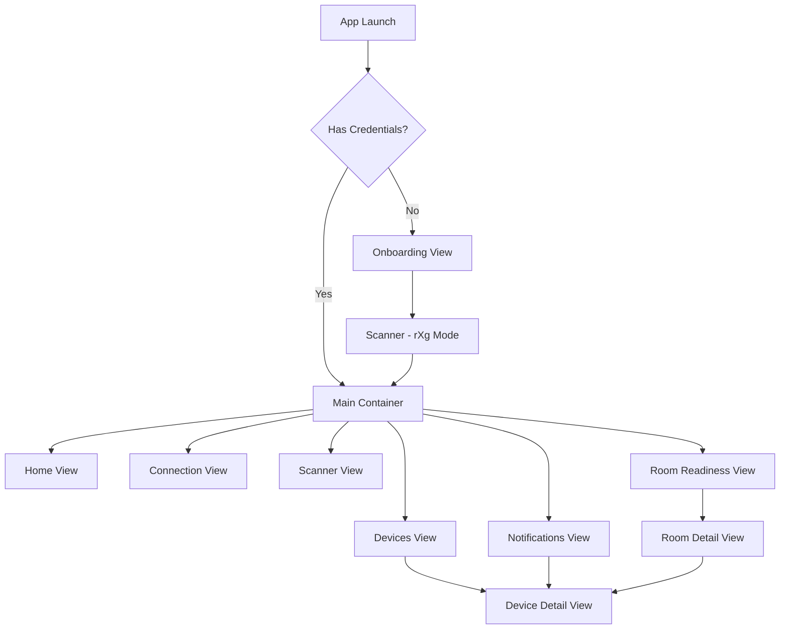

# RG Nets Field Deployment Kit - Screen Specifications

## Table of Contents
1. [Application Architecture](#application-architecture)
2. [Navigation Structure](#navigation-structure)
3. [Main Container View](#main-container-view)
4. [Onboarding View](#onboarding-view)
5. [Home View](#home-view)
6. [Connection View](#connection-view)
7. [Barcode Scanner View](#barcode-scanner-view)
8. [Devices View](#devices-view)
9. [Device Detail View](#device-detail-view)
10. [Notifications View](#notifications-view)
11. [Room Readiness View](#room-readiness-view)
12. [Room Detail View](#room-detail-view)

---

## Application Architecture

### Overview
The RG Nets Field Deployment Kit (FDK) is a Flutter-based mobile application designed for field technicians to manage network infrastructure devices (APs, ONTs, Switches) through integration with RG Nets' rXg systems. The app follows a centralized state management pattern with unified navigation control.

### Core Components
- **State Management**: `AppStateManager` provides centralized state control
- **Navigation**: `UnifiedNavigation` and `SmartNavigationController` handle all navigation
- **API Integration**: `RxgApiClient` manages all backend communication
- **Error Handling**: `ErrorRecovery` system with graceful degradation
- **Async Operations**: `AsyncOperationManager` for cancellable async tasks

### Technology Stack
- **Framework**: Flutter 3.x
- **State Management**: Provider pattern with ChangeNotifier
- **Navigation**: PageView with bottom navigation bar
- **Camera**: MobileScanner for QR/barcode scanning
- **Network**: HTTP with retry logic and offline queue
- **Storage**: SharedPreferences for credential persistence

---

## Navigation Structure

### Primary Navigation
The app uses a `PageView` controlled navigation system with 6 main screens:

```
Index 0: Home View
Index 1: Connection View  
Index 2: Barcode Scanner
Index 3: Devices View
Index 4: Notifications View
Index 5: Room Readiness View
```

### Secondary Navigation (Named Routes)
```
/onboarding     - Initial onboarding flow
/main           - Main container with bottom nav
/room-detail    - Individual room details
/device-detail  - Individual device details
```

### Navigation Flow


---

## Main Container View

### File: `lib/views/main_view.dart`

### Purpose
Central container that hosts all primary views and manages app-wide navigation, authentication state, and UI chrome (app bar, bottom navigation).

### UI Layout

#### Structure
```
Scaffold
├── AppBar
│   ├── RG Nets Logo (left)
│   ├── Title "RG Nets FDK" (center)
│   └── Actions (right)
│       ├── Notification Bell (with badge)
│       └── Connection Status Widget
├── Body
│   ├── TestModeBanner (conditional)
│   └── PageView (6 pages)
└── BottomNavigationBar (6 items)
```

#### App Bar Components
- **Logo**: RG Nets brand logo, 80px height
- **Title**: "RG Nets FDK" text
- **Notification Bell**: 
  - Shows unread count badge (red circle)
  - Displays "99+" for counts > 99
  - Taps navigate to Notifications View
- **Connection Status**: Compact indicator showing rXg connection state

#### Bottom Navigation Items
1. **Home** (Icon: home) - Dashboard overview
2. **Connection** (Icon: wifi) - rXg connection management
3. **Scan** (Icon: qr_code_scanner) - Device scanning
4. **Devices** (Icon: devices) - Device inventory
5. **Notifications** (Icon: notifications) - Alert center
6. **Rooms** (Icon: meeting_room) - Room management

### User Interactions
- **Navigation**: Tap bottom nav items to switch views
- **Notification Badge**: Dynamic update based on `notificationCountNotifier`
- **Navigation Debouncing**: Prevents rapid navigation changes
- **Authentication Gates**: Navigation disabled without valid credentials

### Data Requirements
- **Authentication State**: `RxgApiClient.hasValidCredsNotifier`
- **Notification Count**: `notificationCountNotifier` global value notifier
- **Loading State**: `RxgApiClient.isLoadingData`
- **Current Page Index**: Managed by `AppStateManager`

### State Management
- **Page Controller**: Controls PageView programmatically
- **Navigation State**: Tracks current page, navigation in progress
- **Initialization State**: Manages app startup and credential validation
- **Connectivity Monitoring**: Reacts to network changes

### Key Features
1. **Smart Initialization**:
   - Checks stored credentials on startup
   - Auto-navigates to scanner if no credentials
   - Loads data in background after authentication

2. **Lifecycle Management**:
   - Proper cleanup of subscriptions
   - State preservation across navigation
   - Background data refresh

3. **Error Handling**:
   - Graceful handling of authentication failures
   - Network error recovery
   - Prevents navigation during initialization

---

## Onboarding View

### File: `lib/views/onboarding_view.dart`

### Purpose
First-time user onboarding flow introducing the app and guiding users to connect their rXg system.

### UI Layout

#### Page 1: Welcome Screen
```
Column
├── Hero Image (welcome-hero-image-att.png) - 40% height
├── "Welcome" Title (36pt bold)
├── Description Text (16pt, grey)
│   "Welcome to the RG Nets FDK! Seamlessly connect..."
├── Continue Button (full width, RG Nets dark theme)
└── Page Indicators (dots)
```

#### Page 2: rXg Connection Guide
```
Column
├── Animated GIF (api-flow.gif) - 40% height
│   └── Shows API credential retrieval process
├── "Made for the rXg" Title (36pt bold)
├── Instruction Text (16pt, grey)
│   "Step-by-step guide on accessing the API..."
├── "Connect to your rXg" Button
└── Page Indicators (dots)
```

### User Interactions
- **Page Navigation**: Swipe or tap continue to progress
- **Page Indicators**: Visual feedback of current page
- **Continue Button**: Advances to next page
- **Connect Button**: Navigates to main app (scanner)

### Data Requirements
- **SharedPreferences**: Initialize storage system
- **OUI Database**: Load MAC manufacturer database (handled by AppInitializer)

### State Management
- **PageController**: Manages page transitions
- **TabController**: Syncs with page indicators
- **Animation State**: Smooth page transitions (400ms)

### Navigation Flow
1. User completes onboarding
2. Navigates to `/main` route
3. MainView initializes and shows scanner for rXg connection

---

## Home View

### File: `lib/views/home_view.dart`

### Purpose
Dashboard providing quick access to scanning functionality and at-a-glance system status including device counts and notifications.

### UI Layout

```
RefreshIndicator
└── ListView
    ├── Ready Card (Scanner CTA)
    ├── Devices Section
    │   ├── Section Header "Devices"
    │   └── Device Status Cards (dynamic)
    └── Notifications Section
        ├── Section Header "Notifications"
        └── Notification Cards (dynamic)
```

#### Ready Card
```
Container (150px height, white, rounded)
└── Row
    ├── Scanner Animation (scanner.gif, 140px)
    └── Column
        ├── "Ready to scan!" (24pt bold)
        └── Description (14pt)
```

#### Device Status Cards
```
InkWell → Container (50px height)
└── Row
    ├── Status Icon (check_circle/error)
    ├── Device Count Text
    └── Tap → Navigate to Devices View with filter
```

#### Notification Priority Cards
```
InkWell → Container (50px height)
└── Row
    ├── Priority Icon (urgent/medium/low)
    ├── Notification Summary Text
    └── Tap → Navigate to Notifications with filter
```

### User Interactions
- **Pull to Refresh**: Reloads all rXg data
- **Scanner Card Tap**: Navigate to scanner view
- **Device Card Tap**: Navigate to devices with pre-applied filter
- **Notification Card Tap**: Navigate to notifications with priority filter

### Data Requirements
- **Device Counts**: 
  ```
  RxgApiClient.getOnlineOfflineCount(InfDeviceType)
  - Switches (online/offline)
  - APs (online/offline)
  - ONTs (online/offline)
  ```
- **Notifications**:
  ```
  NotificationManager.urgentNotifications (offline devices)
  NotificationManager.mediumNotifications (devices with notes)
  NotificationManager.lowNotifications (missing images)
  ```

### State Management
- **Loading State**: Shows circular progress during data fetch
- **Refresh Listener**: Updates UI when `loadingMessage` changes
- **Initial Load**: Triggers data fetch on first mount if credentials valid

### Dynamic Content Generation
1. **Device Cards**: Generated based on actual device counts
2. **Notification Cards**: Show only if notifications exist
3. **Empty States**: "No devices found" / "No notifications"

---

## Connection View

### File: `lib/views/connection_view.dart`

### Purpose
Manages rXg system connection, displays current connection status, and provides options to connect to different rXg systems.

### UI Layout

```
Column
├── rXg Image Banner (670x150px, offset)
├── "Profile" Header (30pt)
├── Login Details Section
│   ├── Labels Column (Type, FQDN, Login, State)
│   └── Values Column (dynamic)
├── Action Buttons Row
│   ├── Scan & Connect Button
│   └── Disconnect Button
└── App Version Footer
```

#### Connection Status Display
```
Row (when checking)
├── "Checking connection..." Text
└── CircularProgressIndicator

Row (when connected)
├── "Connected" Text
└── Check Icon (green)

Row (when disconnected)
├── Error Message Text
├── Error Icon (red)
└── Retry Button
```

#### Action Buttons
```
Container (120x width*.4)
├── Icon Circle (RG Nets dark theme background)
├── Button Title (16pt bold)
└── Subtitle Text (12pt)
```

### User Interactions
- **Scan & Connect**: Navigate to scanner in rXg mode
- **Disconnect**: Clear credentials and return to scanner
- **Retry Connection**: Re-check connection status
- **Connection Manager**: Real-time connection monitoring

### Data Requirements
- **Credentials**: 
  ```
  RxgApiClient.credentials
  - fqdn (truncated if > 23 chars)
  - login
  - apiKey (hidden)
  ```
- **Connection Status**: `ConnectionManager.status` ValueNotifier
- **App Version**: Retrieved from `PackageInfo`

### State Management
- **ConnectionManager**: Monitors and reports connection state
- **Loading State**: `isLoadingConnState` for async operations
- **Lifecycle**: Proper cleanup of connection manager on dispose

### Connection States
1. **Checking**: Shows loading spinner
2. **Connected**: Green check, shows "Connected"
3. **No Internet**: Orange warning, retry option
4. **Auth Failed**: Red error, credentials invalid
5. **Server Error**: Red error, rXg unreachable

---

## Barcode Scanner View

### File: `lib/views/barcode_scanner.dart`

### Purpose
Multi-mode QR/barcode scanner for device registration and rXg authentication with intelligent data accumulation and validation.

### UI Layout

```
Stack
├── MobileScanner (camera preview)
├── Overlay UI
│   ├── Top Bar
│   │   ├── Mode Selector (clickable chip)
│   │   └── Flashlight Toggle
│   ├── Scan Frame (250x250px, rounded border)
│   ├── Requirements Display (dynamic)
│   └── Status Messages
└── Processing Overlay (when scanning)
```

#### Mode Selector Chip
```
Container (black54 background)
├── Device Icon (20x20)
├── Mode Name Text
└── Dropdown Arrow (if authenticated)
```

#### Scan Frame States
- **Scanning**: White border (0.5 opacity)
- **Complete**: Green border (data validated)
- **Error**: Red border (validation failed)

#### Requirements Display
Shows real-time scan progress for each mode:
- **rXg Mode**: Single QR with credentials
- **AP Mode**: MAC + Serial (1K format)
- **ONT Mode**: MAC + Serial (ALCL) + Part Number
- **Switch Mode**: MAC + Serial (LL format)

### Scan Modes

#### 1. rXg Authentication Mode
- **Purpose**: Connect to rXg system
- **Required Data**: FQDN, Login, API Key
- **Validation**: Live credential verification
- **Success Action**: Navigate to home, load data

#### 2. Access Point Mode
- **Required Fields**:
  - MAC Address (standard format)
  - Serial Number (must start with "1K")
- **Accumulation**: Multiple QR codes combined
- **Registration**: Assigns to selected room

#### 3. ONT Mode
- **Required Fields**:
  - Part Number
  - MAC Address
  - Serial Number (must start with "ALCL")
- **Accumulation**: Up to 3 QR codes
- **Registration**: Creates ONT in rXg

#### 4. Switch Mode
- **Required Fields**:
  - MAC Address
  - Serial Number (LL prefix validation)
  - Model (optional)
- **Registration**: Not yet implemented

### User Interactions

#### Scanning Flow
1. **Mode Selection**: Tap mode chip to change device type
2. **QR Detection**: Automatic processing on detection
3. **Data Accumulation**: Combines multiple QR codes
4. **Validation**: Real-time format checking
5. **Registration Popup**: Bottom sheet when complete

#### Registration Bottom Sheet
```
Container
├── Device Type Icon
├── Title (New/Existing/Mismatch)
├── Data Display (key-value pairs)
├── Room Selector (DropdownSearch)
├── Action Feedback (what will happen)
└── Action Buttons
    ├── Cancel
    └── Hold to Register/Move
```

### Data Requirements
- **PMS Rooms**: `RxgApiClient.getPMSRooms()`
- **Device Lists**: Current APs/ONTs for duplicate checking
- **MAC Database**: Manufacturer lookup
- **Validation Rules**: Device-specific serial formats

### State Management

#### ScannerStateManager
- **Scan Mode**: Current device type
- **Scan Data**: Accumulated barcode data
- **Processing State**: Prevents duplicate scans
- **UI State**: scanning/validating/success/error
- **Expiration Timer**: Clears partial data after 30s

#### Camera Lifecycle
- **Auto-start**: When navigating to scanner
- **Auto-stop**: When navigating away
- **App Lifecycle**: Handles background/foreground
- **Permission Management**: Camera access handling

### Validation Service
- **Format Validation**: Serial number patterns
- **MAC Validation**: Standard format checking
- **Duplicate Detection**: Checks existing devices
- **Mismatch Detection**: Identifies data conflicts

### Advanced Features

#### Device Matching
- **Full Match**: All fields match existing device
- **Partial Match**: MAC matches but other fields differ
- **Mismatch**: Data conflicts requiring resolution
- **New Device**: No existing match found

#### Smart Accumulation
- **Debouncing**: 2-second delay between scans
- **Field Mapping**: Intelligent data extraction
- **Progress Tracking**: Real-time requirement updates
- **Expiration**: Auto-clear after 30 seconds

#### Error Handling
- **Camera Errors**: Graceful fallback UI
- **Network Errors**: Offline queue support
- **Validation Errors**: Clear user feedback
- **Registration Failures**: Retry mechanisms

---

## Devices View

### File: `lib/views/devices_view.dart`

### Purpose
Inventory management screen displaying all registered devices with filtering, search, and quick actions.

### UI Layout

```
ListView (non-scrollable parent)
├── Search Bar
├── Filter Buttons Row
└── RefreshIndicator
    └── Device List (scrollable)
        └── Device Cards (swipe-to-delete)
```

#### Search Bar
```
Container (50px height, white, bordered)
└── TextField
    ├── Search Icon
    ├── "Search by name" Hint
    └── Clear Button (when active)
```

#### Filter Buttons
```
Row (equal spacing)
├── Switch Filter Button
├── AP Filter Button
├── ONT Filter Button
└── All Filter Button
```

#### Device Card
```
Dismissible (swipe right-to-left)
├── Background (red, delete icon)
└── InkWell → Container (66px height)
    └── Column
        ├── Header Row (Type | Status)
        └── Content Row (Name | Status Icon)
```

### User Interactions
- **Search**: Real-time filtering by device name
- **Filter Buttons**: Toggle device type visibility
- **Card Tap**: Navigate to device detail view
- **Swipe to Delete**: Confirmation dialog → API delete
- **Pull to Refresh**: Reload all device data

### Data Requirements
- **Device Lists**:
  ```
  RxgApiClient.switches.results
  RxgApiClient.aps.results
  RxgApiClient.onts.results
  ```
- **Device Properties**:
  - id, name, online status
  - ip/host, mac, serial_number
  - note, images array

### State Management
- **Filter State**: `deviceFilter` (global)
- **Search State**: `deviceFilterString` (local)
- **List Generation**: Dynamic based on filters

### Delete Operation
1. **Swipe Gesture**: Shows red delete background
2. **Confirmation Dialog**: "Delete Device" prompt
3. **API Call**: `RxgApiClient.deleteDevice(type, id)`
4. **Result Handling**:
   - Success: Green snackbar
   - No Internet: Orange snackbar, queued
   - Failure: Red snackbar

### Empty States
- **No Devices**: Shows "No devices!" card
- **No Search Results**: Empty list (implicit)

---

## Device Detail View

### File: `lib/views/device_detail_view.dart`

### Purpose
Comprehensive device information display with image management, port details, notifications, and onboarding status visualization.

### UI Layout

```
Scaffold
├── AppBar (device name)
└── SingleChildScrollView
    ├── Device Details Table
    ├── Port Information (ONT/Switch only)
    ├── Images Section
    └── Notifications Section
```

#### Device Details Table
Common fields:
- Type, Name, IP, MAC, S/N

Device-specific fields:
- **ONT**: Room, Onboarding Status, OLT PON Port, Firmware, Uptime
- **AP**: Room, Onboarding Status, Connection State, Firmware, Uptime
- **Switch**: Port Count, Config Sync Status

#### Onboarding Status Display
```
Column
├── Status Text (colored by state)
├── SegmentedProgressBar (visual progress)
├── Error Message (if applicable)
└── Stage Description Text
```

#### Images Section
```
Horizontal ListView (100px height)
├── Thumbnail Images (tap to enlarge)
└── Add Image Button (+)
```

#### Port Information (ONT)
```
DataTable
├── Locked Ports List
└── Link Neighbors (LLDP)
```

#### Port Information (Switch)
```
Column
├── Summary Table (count, online, sync)
└── Port Cards List
    └── Card (port number, speed, type, status)
```

### User Interactions

#### Image Management
- **Add Image**: Camera/Gallery picker → Base64 upload
- **View Image**: Tap thumbnail → Full screen view
- **Delete Image**: Tap delete in enlarged view
- **Image Loading**: Automatic retry on error

#### Notifications
- **View**: Grouped by priority (urgent/medium/low)
- **Clear Notes**: X button on medium priority items
- **Navigation**: Handled by parent views

### Data Requirements
- **Device Data**: Passed via navigation arguments
- **Port Info (ONT)**: 
  ```
  RxgApiClient.getONTPortInfo(deviceId)
  RxgApiClient.getONTLockedPortInfo(deviceId)
  ```
- **Port Info (Switch)**:
  ```
  RxgApiClient.getSwitchPorts(deviceId)
  ```
- **Images**: `RxgApiClient.getImagesForDevice(type, id)`
- **Notifications**: `NotificationManager.getNotificationsForDevice()`

### State Management
- **Image List**: Mutable copy of passed images
- **Enlarged Image**: Index and visibility state
- **Port Loading**: Async load with loading indicator
- **Cache Management**: Switch ports cached in RxgApiClient

### Advanced Features

#### Onboarding Progress
- **Visual Indicator**: Segmented circles (filled/unfilled)
- **Color Coding**: Green (complete), Orange (in progress)
- **Stage Display**: Human-readable progress description
- **Error Handling**: Red text for failure states

#### Port Details (Switch)
- **Port Cards**: Individual status per port
- **Speed Display**: Formatted (Gbps/Mbps/Kbps)
- **Port Types**: Tagged display (access/trunk)
- **Link Status**: Red/Green indicator

#### Image Upload Flow
1. **Source Selection**: Camera or Gallery dialog
2. **Image Capture/Selection**: Native picker
3. **Base64 Encoding**: Client-side conversion
4. **Upload with Retry**: Queued if offline
5. **Automatic Refresh**: Updates image list

---

## Notifications View

### File: `lib/views/notifications_view.dart`

### Purpose
Centralized notification center displaying system alerts, device issues, and actionable items with multi-dimensional filtering.

### UI Layout

```
Scrollbar → ListView
├── Device Filter Buttons Row
├── Priority Filter Buttons Row
└── RefreshIndicator
    └── Notifications List
        └── Notification Cards
```

#### Filter Button Rows
```
Row (equal spacing)
├── Switch | AP | ONT | All (Device filters)
└── Urgent | Medium | Low | All (Priority filters)
```

#### Notification Card
```
InkWell → Container (50px height)
└── Row
    ├── Priority Icon (20px)
    ├── Notification Text (wrapped, 70% width)
    └── Clear Button (medium priority only)
```

### User Interactions
- **Device Filter**: Show notifications for specific device type
- **Priority Filter**: Show notifications by severity
- **Card Tap**: Navigate to device detail view
- **Clear Note**: Remove medium priority notifications
- **Pull to Refresh**: Reload all notification data

### Data Requirements
- **Notification Lists**:
  ```
  NotificationManager.urgentNotifications
  NotificationManager.mediumNotifications  
  NotificationManager.lowNotifications
  ```
- **Device Lookup**: Cross-reference with device lists for navigation

### State Management
- **Filter States** (Global):
  ```
  notificationDeviceFilter: DeviceFilter
  notificationPriorityFilter: NotificationPriorityFilter
  ```
- **Dynamic Filtering**: Applied in `_generateNotifications()`

### Notification Types

#### Urgent (Red)
- **Trigger**: Device offline
- **Icon**: urgent-notification.png
- **Action**: Navigate to device
- **Clear**: Not available (auto-clears when online)

#### Medium (Orange)  
- **Trigger**: Device has notes
- **Icon**: medium-notification.png
- **Action**: Navigate to device
- **Clear**: X button to clear note

#### Low (Green)
- **Trigger**: Missing device images
- **Icon**: low-notification.png
- **Action**: Navigate to device
- **Clear**: Not available (auto-clears when image added)

### Navigation Flow
1. **Tap Notification**: Extract device info
2. **Find Device**: Search in appropriate list
3. **Fetch Images**: Load device images
4. **Navigate**: Pass full device data to detail view
5. **Fallback**: Orange snackbar if device not found

### Empty State
- **No Notifications**: Shows "No notifications!" card

---

## Room Readiness View

### File: `lib/views/room_readiness_view.dart`

### Purpose
PMS room inventory screen showing all rooms in the system with search capability and navigation to detailed room status.

### UI Layout

```
Column
├── Search TextField (full width)
│   ├── Search Icon
│   ├── "Search Rooms" Placeholder
│   └── Clear Button (when active)
└── RefreshIndicator
    └── ListView (separated)
        └── Room ListTiles
```

#### Room ListTile
```
ListTile
├── Title: Room Name
├── Subtitle: (none currently)
├── Trailing: (reserved for status)
└── onTap → Navigate to Room Detail
```

### User Interactions
- **Search**: Real-time room name filtering
- **Clear Search**: X button clears filter
- **Room Selection**: Tap navigates to room detail
- **Pull to Refresh**: Reload room list from API

### Data Requirements
- **Room List**: 
  ```
  RxgApiClient.pmsRooms.results
  - id: Room identifier
  - room: Room name/number
  ```

### State Management
- **Search State**: 
  ```
  _searchActive: Boolean flag
  _searchController: Text input controller
  ```
- **Data Loading**: Triggered on mount and refresh
- **Error Handling**: Safe access with null checks

### Features
- **Case-Insensitive Search**: Lowercase comparison
- **Separated List**: Visual dividers between rooms
- **Async Data Load**: Non-blocking room fetch
- **Error Recovery**: Graceful handling of API failures

---

## Room Detail View

### File: `lib/views/room_detail_view.dart`

### Purpose
Comprehensive room readiness dashboard showing real-time device status, onboarding progress, and configuration sync state with auto-refresh capabilities.

### UI Layout

```
Scaffold
├── AppBar ("Room {name}")
└── RefreshIndicator
    └── ListView
        ├── Refresh Controls
        │   ├── Manual Refresh Button
        │   └── Auto-refresh Progress Bar
        ├── Room Graphic (room-readiness-graphic.png)
        ├── ONT Details Section
        │   └── ONT Data Tables (multiple)
        ├── AP Details Section
        │   └── AP Data Tables (multiple)
        └── Config Sync Section
            └── Sync Status Table
```

#### Refresh Controls
```
Row
├── IconButton (refresh icon)
├── Animated LinearProgressIndicator (5s cycle)
└── Visual feedback for auto-refresh
```

#### Device Data Table
```
CustomDataTable
├── Headers: Name, Status, MAC, Uptime, Actions
├── Status Cell: Custom widget with progress
├── Action Cell: "View Full Details" button
└── Data rows with formatted values
```

#### Onboarding Progress Widget
```
Column
├── Status Text (colored)
├── SegmentedProgressBar (visual stages)
├── Error Message (if failed)
└── Stage Description
```

### User Interactions
- **Manual Refresh**: Icon button for immediate update
- **Auto Refresh**: 5-second automatic cycle
- **Pull to Refresh**: Swipe down gesture
- **View Device**: Navigate to device detail
- **Progress Animation**: Visual refresh countdown

### Data Requirements

#### Initial Load
```
RxgApiClient.getIndividualPMSRoom(roomId)
- media_converters: ONT list with IDs
- access_points: AP list with IDs
```

#### Device Details
```
RxgApiClient.getONTs() - Full ONT data
RxgApiClient.getAPs() - Full AP data
RxgApiClient.getONTPortInfo(ontId) - Port details
RxgApiClient.getONTLockedPortInfo(ontId) - Lock status
```

#### Room Readiness
```
RxgApiClient.getRoomReadinessData(ontIDs, apIDs)
- Aggregated status information
- Sync states
- Onboarding progress
```

### State Management

#### Timers
- **Refresh Timer**: 5-second interval for data updates
- **Animation Controller**: Progress bar animation loop
- **Lifecycle Management**: Proper cleanup on dispose

#### Navigation State
- **Navigation Debounce**: `_isNavigating` flag
- **Prevents multiple simultaneous navigations**

#### Data State
```
ontIDs: List<int> - ONT device IDs
apIDs: List<int> - AP device IDs
ontPortInfo: Map<String, dynamic> - Port data cache
ontLockedPortInfo: Map<String, dynamic> - Lock data cache
```

### Advanced Features

#### Onboarding Visualization
- **ONTs**: 5-stage progress (0-5)
- **APs**: 6-stage progress (0-6)
- **Color Coding**: Green (complete), Orange (progress), Red (error)
- **Stage Descriptions**: Human-readable status

#### Config Sync Status
- **WLAN Controller**: Last sync vs attempt comparison
- **OLT**: Last sync vs attempt comparison
- **Visual Indicator**: Yes/No status display

#### Auto-Refresh System
1. **5-Second Cycle**: Automatic data refresh
2. **Visual Feedback**: Animated progress bar
3. **Non-Blocking**: Async operations
4. **Error Resilient**: Continues on failure

#### Empty States
- **No ONTs**: "No ONTs found in this room"
- **No APs**: "No Access Points found in this room"
- **Placeholder Tables**: When devices exist but no data

### Performance Optimizations
- **Mounted Checks**: Prevent setState on unmounted widgets
- **Async Operations**: Non-blocking data fetches
- **Selective Updates**: Only refresh changed data
- **Timer Management**: Proper cleanup to prevent leaks

---

## Common UI Components

### Custom Data Table
- **Purpose**: Consistent data display across views
- **Features**: Key-value pairs, custom widgets, responsive sizing
- **Usage**: Device details, port info, sync status

### Connection Status Widget
- **Purpose**: Real-time connection monitoring
- **States**: Connected, Connecting, Offline, Error
- **Placement**: App bar, connection view

### Test Mode Banner
- **Purpose**: Visual indicator for test environment
- **Display**: Orange banner when in test mode
- **Configuration**: Environment-based visibility

### Scanner Requirements Display
- **Purpose**: Real-time scan progress feedback
- **Features**: Field status, missing data indication
- **Updates**: Dynamic as QR codes are scanned

### Hold to Confirm Button
- **Purpose**: Prevent accidental actions
- **Features**: Progress animation, configurable duration
- **Usage**: Device registration, moves

---

## Data Flow Architecture

### API Integration Pattern
```
View → RxgApiClient → HTTP Request → rXg API
     ↓                    ↓              ↓
State Update ← Response ← HTTP Response ←
```

### State Update Pattern
```
User Action → State Manager → Notifier Update → UI Rebuild
                    ↓
              Side Effects (Navigation, API calls)
```

### Error Handling Flow
```
Error → ErrorRecovery → Severity Assessment → User Notification
                ↓                                   ↓
          Retry Logic                        Graceful Degradation
```

---

## Navigation Patterns

### Bottom Navigation
- **Persistent**: Always visible except in secondary screens
- **State Preservation**: PageView maintains widget state
- **Authentication Gate**: Disabled without credentials

### Stack Navigation
- **Push Pattern**: Secondary screens use Navigator.push
- **Arguments**: Pass data via route arguments
- **Back Navigation**: System back button or app bar back

### Programmatic Navigation
- **UnifiedNavigation**: Centralized navigation control
- **SmartNavigationController**: Advanced navigation tracking
- **Debouncing**: Prevents rapid navigation changes

---

## Performance Considerations

### Optimization Strategies
1. **Lazy Loading**: Data fetched on demand
2. **Caching**: Device and room data cached
3. **Debouncing**: Search and navigation throttling
4. **Background Tasks**: Non-blocking async operations

### Memory Management
1. **Subscription Cleanup**: Proper disposal of listeners
2. **Timer Management**: Cancel timers on dispose
3. **Image Optimization**: Thumbnail generation for lists
4. **State Cleanup**: Clear unnecessary data on navigation

### Network Optimization
1. **Retry Logic**: Automatic retry with backoff
2. **Offline Queue**: Actions queued when offline
3. **Batch Requests**: Multiple operations combined
4. **Connection Monitoring**: Real-time status updates

---

## Security Considerations

### Credential Management
- **Storage**: Encrypted SharedPreferences
- **Validation**: Server-side credential verification
- **Cleanup**: Secure credential removal on logout
- **Transmission**: HTTPS only for API communication

### Data Protection
- **API Keys**: Never displayed in UI
- **Sensitive Data**: Masked in logs
- **Error Messages**: Sanitized for user display
- **Session Management**: Automatic timeout handling

---

## Accessibility Features

### Current Support
- **Text Scaling**: Responsive font sizes
- **Color Contrast**: High contrast UI elements
- **Touch Targets**: Minimum 48x48 dp
- **Loading States**: Clear visual feedback

### Future Enhancements
- **Screen Reader**: Semantic labels needed
- **Keyboard Navigation**: Focus management required
- **Voice Control**: Command integration planned
- **Dark Mode**: Theme switching capability

---

## Testing Considerations

### Unit Testing
- **State Managers**: Isolated state logic testing
- **Validation Services**: Format and rule validation
- **API Clients**: Mocked network responses
- **Navigation Logic**: Route calculation testing

### Widget Testing
- **Individual Views**: Component isolation
- **User Interactions**: Gesture and tap testing
- **State Changes**: UI update verification
- **Navigation Flow**: Route transition testing

### Integration Testing
- **End-to-End Flows**: Complete user journeys
- **API Integration**: Real backend testing
- **Device Registration**: Full cycle validation
- **Error Scenarios**: Recovery mechanism testing

---

## Deployment Configuration

### Build Variants
- **Development**: Debug mode with extensive logging
- **Staging**: Test environment with test data
- **Production**: Release mode with Sentry integration

### Environment Variables
```
API_BASE_URL: rXg endpoint
SENTRY_DSN: Error reporting endpoint
TEST_MODE: Enable test features
DEBUG_LEVEL: Logging verbosity
```

### Platform-Specific
- **iOS**: Camera permissions, network configuration
- **Android**: Camera permissions, network security config
- **Web**: Not currently supported

---

## Maintenance Guidelines

### Code Organization
- **Views**: UI and layout logic only
- **Services**: Business logic and API calls
- **State**: Application state management
- **Utils**: Shared utilities and helpers

### Documentation Standards
- **Inline Comments**: Complex logic explanation
- **Method Documentation**: Purpose and parameters
- **TODO Comments**: Future enhancements
- **FIXME Comments**: Known issues

### Version Control
- **Feature Branches**: feature/description
- **Bug Fixes**: fix/description
- **Releases**: release/version
- **Hotfixes**: hotfix/description